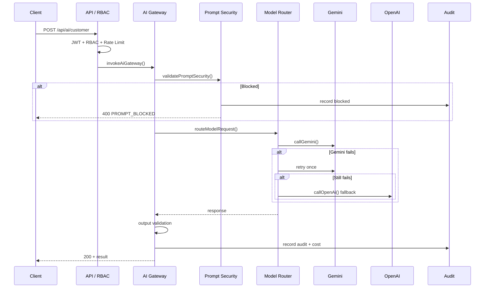

# Phase 3 Enterprise AI Core — API Documentation

**Base URL:** `/api/ai`  
**Authentication:** Bearer JWT required (except `/health`)

## POST /api/ai/customer

Customer-facing AI completion via the Enterprise Gateway.

**Auth:** CUSTOMER role

**Request:**
```json
{
  "message": "I need AC repair in Gurgaon",
  "templateId": "customer.support.v1",
  "history": [
    { "role": "user", "content": "Hi" },
    { "role": "assistant", "content": "Hello! How can I help?" }
  ],
  "context": {
    "bookingId": "clxyz...",
    "location": { "lat": 28.46, "lng": 77.03, "city": "Gurugram" }
  }
}
```

**Response:**
```json
{
  "success": true,
  "data": {
    "requestId": "uuid",
    "content": "AI response text",
    "provider": "GEMINI",
    "model": "gemini-2.0-flash",
    "status": "SUCCESS",
    "latencyMs": 1234,
    "promptTokens": 150,
    "completionTokens": 80,
    "cachedTokens": 0,
    "costUsd": 0.000035,
    "fallbackUsed": false,
    "templateId": "customer.support.v1"
  }
}
```

## POST /api/ai/partner

Partner-facing AI completion.

**Auth:** VENDOR role

Same request/response shape as customer endpoint. Default template: `partner.ops.v1`.

## POST /api/ai/admin

Admin operations AI completion.

**Auth:** ADMIN role

Same request/response shape. Default template: `admin.ops.v1`.

## POST /api/ai/gateway/chat

Role-mapped chat endpoint (CUSTOMER, ADMIN, or VENDOR based on JWT role).

## GET /api/ai/usage

AI usage summary.

**Auth:** ADMIN only

**Query:** `days` (default 7, max 90)

**Response:**
```json
{
  "success": true,
  "data": {
    "periodDays": 7,
    "totalRequests": 1234,
    "totalCostUsd": 0.45,
    "byProvider": {
      "GEMINI": { "requests": 1100, "costUsd": 0.30 },
      "OPENAI": { "requests": 134, "costUsd": 0.15 }
    },
    "byRole": {
      "CUSTOMER": { "requests": 800, "costUsd": 0.20 }
    }
  }
}
```

## GET /api/ai/cost

Daily cost breakdown.

**Auth:** ADMIN only

**Query:** `days` (default 30, max 90)

## GET /api/ai/health

Gateway health check. No authentication required.

**Response:**
```json
{
  "success": true,
  "data": {
    "status": "ok",
    "gateway": true,
    "gemini": { "configured": true, "circuit": "closed" },
    "openai": { "configured": true, "circuit": "closed" },
    "timestamp": "2026-08-07T12:00:00.000Z"
  }
}
```

## Error Codes

| Code | HTTP | Description |
|------|------|-------------|
| `FORBIDDEN` | 403 | Role not authorized |
| `RATE_LIMITED` | 429 | Rate limit exceeded |
| `PROMPT_BLOCKED` | 400 | Security block (injection/secrets) |
| `VALIDATION_ERROR` | 400 | Input validation failed |
| `TIMEOUT` | 504 | Gateway timeout (25s) |
| `PROVIDER_ERROR` | 502 | Both providers failed |
| `GATEWAY_DISABLED` | 502 | AI Gateway disabled |

## Sequence Diagram


