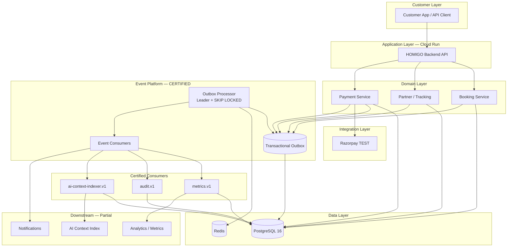
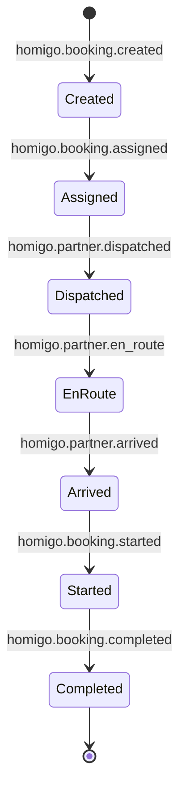
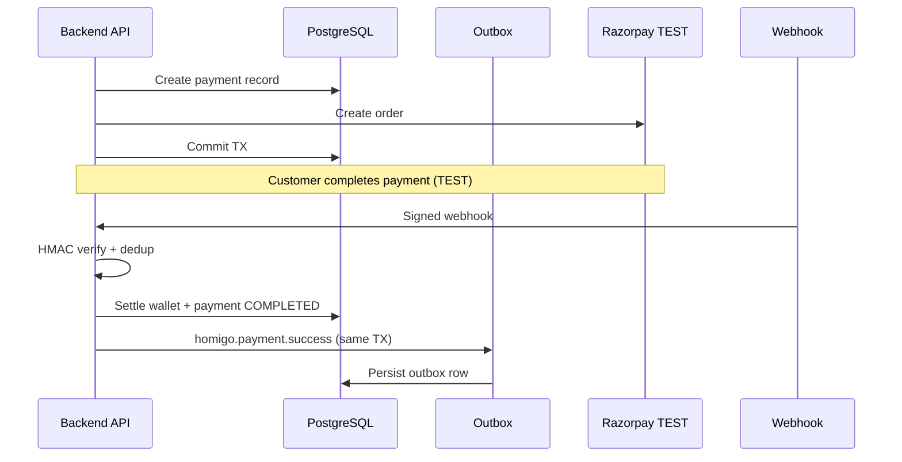
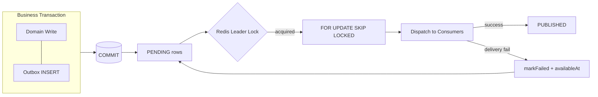
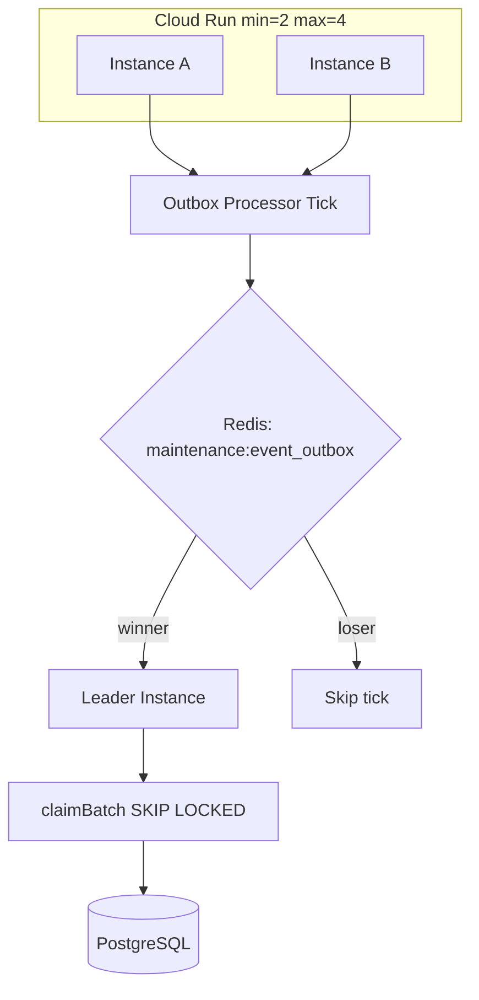
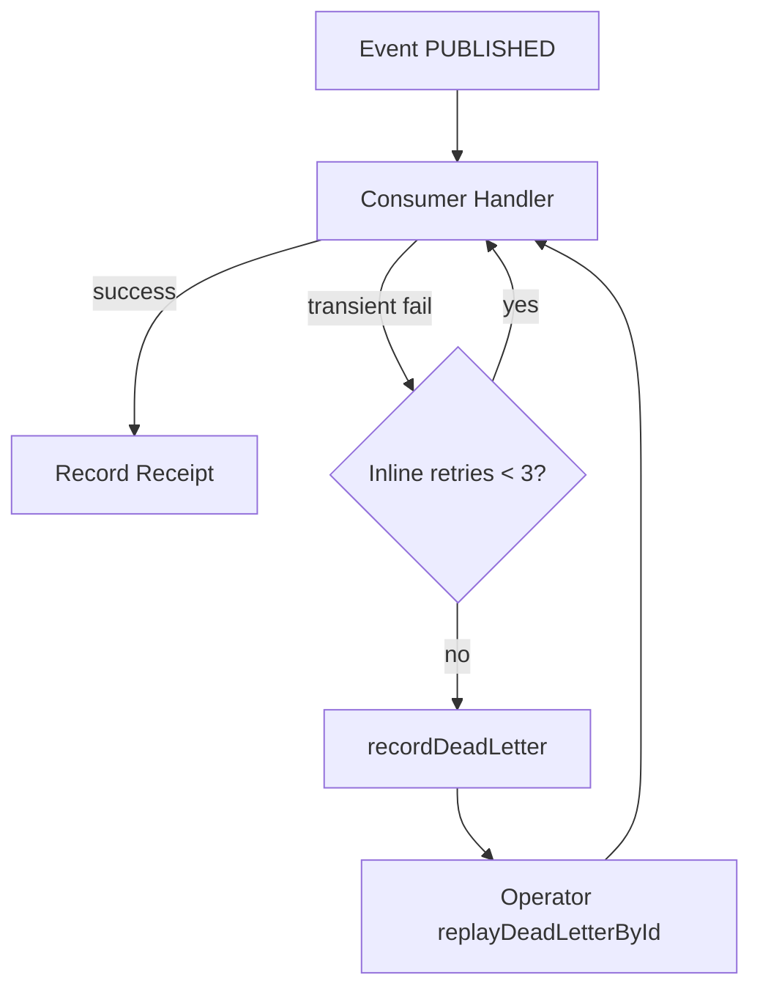
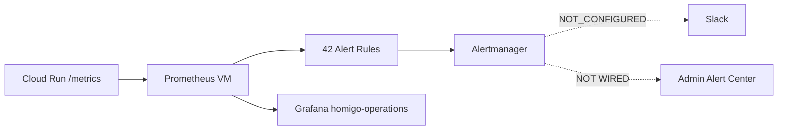
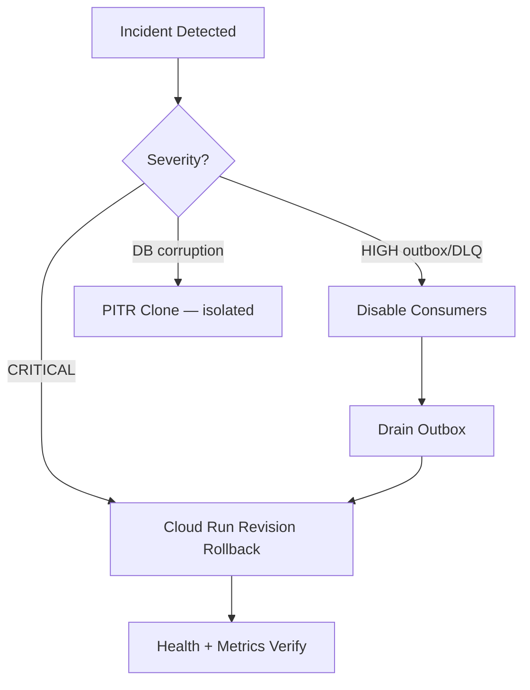
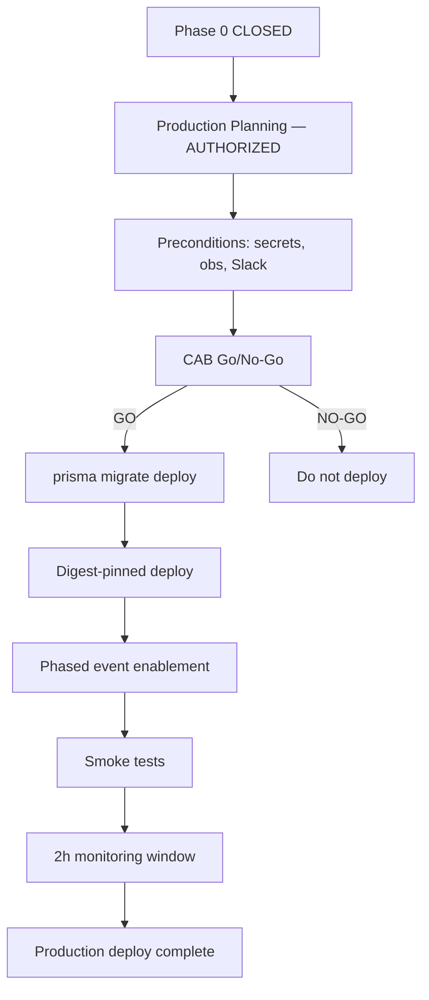

# HOMIGO Enterprise System Blueprint

**Document ID:** `ARCH-BLUEPRINT-001`  
**Certified RC:** `c31f154a128022fa7d9c4e44652506eedf3fa3e4`  
**Environment:** Staging certified · **Production NOT DEPLOYED**  
**Navigation:** [ADR Index](./ADR-INDEX.md) · [Traceability Matrix](./MASTER-TRACEABILITY-MATRIX.md) · [Documentation Index](../DOCUMENTATION-INDEX.md)

---

## 1. Platform Overview

HOMIGO is a home-services platform connecting customers, partners (service providers), and payment infrastructure. Phase 0 certified the **backend event foundation** on Google Cloud Platform staging: booking lifecycle, partner tracking, Razorpay TEST payments, transactional outbox, and observability.

---

## 2. Layer Model

| Layer | Components | Certification |
|-------|------------|---------------|
| **Business** | Booking, partner dispatch, payments, notifications | Stage D PASS |
| **Application** | Cloud Run API (`homigo-backend-staging`) | Stage G PASS |
| **Domain** | Domain services, event emitters, consumers | Stage D/E PASS |
| **Infrastructure** | Cloud SQL PG 16, Redis, Secret Manager | Stage C/G PASS |
| **Security** | OPS auth, JWT, Razorpay HMAC, secret isolation | Step 8/12 PASS |
| **Observability** | Prometheus, Grafana, Alertmanager, Cloud Logging | Stage F PASS_WITH_LIMITATION |
| **Automation** | Scheduled job creation (execution deferred Phase 6) | LIMITATION |
| **AI** | `ai-context-indexer.v1` consumer | Stage D/E PASS |
| **Data** | PostgreSQL authoritative store, Redis coordination | Stage C/G PASS |
| **Integration** | Razorpay TEST, push notifications (staging synthetic) | Step 12 PASS |
| **Deployment** | Digest-pinned Cloud Run, migrate jobs | ADR-010 |
| **Recovery** | PITR, backups, rollback runbooks | Stage C PASS |
| **Certification** | Stages C–G harness + 237 evidence artifacts | CLOSED |

---

## 3. End-to-End Platform Flow



---

## 4. Booking Lifecycle



**Certified:** Step 10, Stage D harness 18/18 gates  
**Evidence:** `docs/evidence/stage-d-step-10/step-10-booking-events.json`

---

## 5. Partner Lifecycle

| Stage | Timestamp Column | Event |
|-------|------------------|-------|
| Dispatch | `assignment_attempts.dispatched_at` | `homigo.partner.dispatched` |
| En route | `bookings.en_route_at` | `homigo.partner.en_route` |
| Arrived | `bookings.arrived_at` | `homigo.partner.arrived` |
| Travel duration | `bookings.travel_duration_min` | Derived |

**Certified:** Step 11 — GPS sequence, ETA label integrity PASS  
**Evidence:** `docs/evidence/stage-d-step-11/step-11-partner-events.json`

---

## 6. Payment Lifecycle



**Certified:** Step 12 — TEST mode only; 0 duplicate effects  
**Production LIVE:** NOT CERTIFIED

---

## 7. Outbox Architecture



**ADR:** ADR-001 · **Evidence:** Step 14 burst drain PASS

---

## 8. Leader Election + SKIP LOCKED



**Certified:** Step 13 — 20/20 events, 0 uncontrolled duplicate claims  
**ADR:** ADR-003

---

## 9. Idempotency

```
Delivery:     AT-LEAST-ONCE (transport may duplicate)
Enforcement:  UNIQUE(consumer_name, event_id) on event_consumer_receipts
Effect:       EXACTLY-ONCE business effects
```

**Certified:** Step 15 — concurrent race, 0 duplicate effects  
**ADR:** ADR-006

---

## 10. Retry Flow



**ADR:** ADR-004, ADR-005 · **Evidence:** Step 16

---

## 11. DLQ + Replay

| State | Table | Metric |
|-------|-------|--------|
| Unresolved failure | `event_dead_letters` | `homigo_dlq_unresolved` |
| After replay | Resolved | Metric decrements |

**Limitation:** Operator WHO not logged (Step 16 AUDIT_GAP)

---

## 12. Alert Flow



**Certified:** Stage F PASS_WITH_LIMITATION — Slack NOT_CONFIGURED  
**ADR:** ADR-008, ADR-009

---

## 13. Metrics Flow

| Source | Path | Auth |
|--------|------|------|
| Application | `/metrics` | OPS Bearer |
| Prometheus | Scrape staging Cloud Run | STAGING_OPS_AUTH_TOKEN |
| Grafana | PromQL dashboards | STAGING_GRAFANA_ADMIN_PASSWORD |

**Key metrics:** `homigo_outbox_pending`, `homigo_dlq_unresolved`, `homigo_consumer_failed_rate`, `homigo_domain_event_total`

---

## 14. Log Flow

| Source | Destination | Correlation |
|--------|-------------|-------------|
| Cloud Run stdout | Cloud Logging (JSON) | `traceId`, `correlationId`, `requestId` |
| Grafana | Manual Cloud Logging query | PARTIAL — no Loki |

**OTel export:** NOT IMPLEMENTED — `opentelemetry-gap-analysis.md`

---

## 15. Trace Flow

```
HTTP Request → traceId (W3C traceparent)
            → business service
            → outbox (correlationId in envelope)
            → consumer (correlationId preserved)
            → logs searchable by traceId/correlationId
```

**Distributed trace export:** DEFERRED (spans in-memory only; lost on recycle)

---

## 16. Rollback Flow



**Runbook:** [ROLLBACK-RUNBOOK.md](../operations/ROLLBACK-RUNBOOK.md)

---

## 17. Production Promotion Flow



**Status:** Planning authorized · **Deploy:** NOT EXECUTED  
**ADR:** ADR-012 · **Runbook:** [PRODUCTION-PROMOTION-RUNBOOK.md](../operations/PRODUCTION-PROMOTION-RUNBOOK.md)

---

## 18. Runtime Topology (Staging — Certified)

```
                    ┌─────────────────────────────────┐
                    │  homigo-backend-staging         │
                    │  RC c31f154 / rev 00029-pbn     │
                    │  min=2 max=4 · asia-south1      │
                    └───────────────┬─────────────────┘
                                    │
         ┌──────────────────────────┼──────────────────────────┐
         │                          │                          │
┌────────▼────────┐       ┌─────────▼─────────┐       ┌────────▼────────┐
│ Cloud SQL PG 16 │       │ Redis (secret)    │       │ homigo-obs-stg  │
│ step6a-pitr     │       │ Leader lock       │       │ Prom+Graf+AM    │
│ 31/31 migrations│       │ Cache             │       │ 8.231.83.218    │
└─────────────────┘       └───────────────────┘       └─────────────────┘
```

**Evidence:** `stage-g-release-identity.json`, `stage-f-remediation/cloud-inventory.json`

---

## 19. Certification Layer

| Stage | Validates |
|-------|-----------|
| C | DB foundation, PITR, schema |
| D | Booking, partner, payment |
| E | Outbox, multi-instance, idempotency, DLQ |
| F | Metrics, Grafana, alerts |
| G | Soak, stability, business regression |

**237 artifacts:** `docs/evidence/` · **Dossier:** `docs/final-certification/`

---

## 20. Related Documents

| Document | Path |
|----------|------|
| ADR Index | [ADR-INDEX.md](./ADR-INDEX.md) |
| Traceability Matrix | [MASTER-TRACEABILITY-MATRIX.md](./MASTER-TRACEABILITY-MATRIX.md) |
| Final Report | [PHASE-0-FINAL-CERTIFICATION-REPORT.md](../final-certification/PHASE-0-FINAL-CERTIFICATION-REPORT.md) |
| Radar Spec (deferred UI) | [homigo-radar-v1.md](./homigo-radar-v1.md) |

---

**Blueprint status:** Reflects certified staging @ RC `c31f154` · Production architecture **NOT DEPLOYED**
