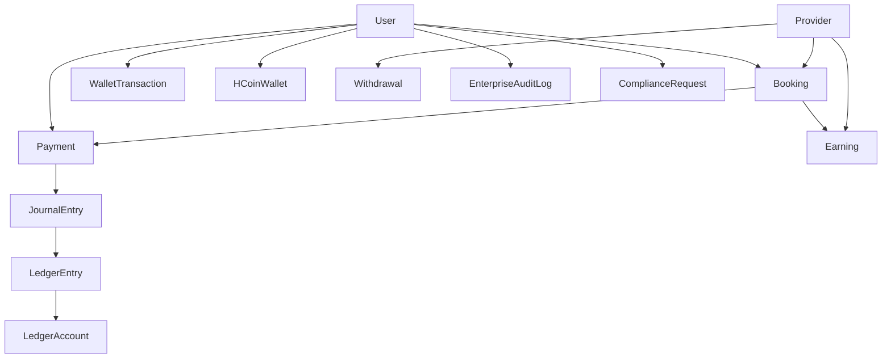

# HOMIGO Database Audit — Phase 0 Discovery

**Mission:** Enterprise Hardening (58 → 85+/100)  
**Audit date:** 2026-06-10  
**Auditor role:** Principal Staff Engineer / FinTech Architect / DBA / SRE  
**Evidence rule:** No claim without execution proof.

---

## Executive Summary

| Dimension | Current State | Target (Mission) | Gap |
|-----------|---------------|------------------|-----|
| Schema coverage | 114 models, 70 enums, 115 PG tables | Full inventory | ✅ Documented |
| PII encryption | **99.4% plaintext** (170/171 users) | 100% encrypted | ❌ Phase 1 critical |
| Money integrity | Dual-write active, **0 drift** on core columns | BIGINT-only, 0 drift @ 1M txns | ⚠️ Phase 2 in progress |
| Booking overlap | **2 DB exclusion constraints** live | 0 overlaps @ 1000 VU | ⚠️ Needs load proof |
| Payment idempotency | `idempotencyKey` + `WebhookEventDedup` in schema | 0 double-charge @ 500 VU | ⚠️ Needs live Razorpay proof |
| Indexes | **506 indexes**, referenceId indexed | p95 &lt; 50ms reads | ⚠️ Needs EXPLAIN evidence |
| Orphan tables | **0** DB tables without Prisma model | 0 | ✅ |
| Overall platform score | **73/100** (prior audit) | **85+/100** | 12+ points to close |

**Verdict:** Backend schema and financial controls are **mature on paper**; PII backfill, Float column retirement, live payment/integration proof, and load/DR execution remain **blocking** for enterprise certification.

---

## Step 1 — Schema Audit

### Scale

| Asset | Count | Source |
|-------|-------|--------|
| Prisma `model` definitions | **114** | `schema.prisma` |
| Prisma `enum` definitions | **70** | `schema.prisma` |
| PostgreSQL `public` tables | **115** | Live SQL (`phase0-discovery-sql.ts`) |
| Foreign keys | **113** | `information_schema` |
| Indexes | **506** | `pg_indexes` |
| Exclusion constraints | **2** | `pg_constraint` (booking slots) |
| Prisma migrations applied | **35** | `prisma migrate status` |

**Table parity:** 114 application tables + `_prisma_migrations` = 115. **Zero orphan DB tables** (no table exists in PostgreSQL without a Prisma `@@map`).

### All 114 Models (grouped by domain)

<details>
<summary>Core identity & auth (12)</summary>

User, UserDevice, OTP, PasswordHistory, RefreshToken, TokenBlacklist, UserAuthEpoch, AdminRole, AdminPermission, AdminUser, PartnerRegistrationSession, SavedPaymentMethod
</details>

<details>
<summary>Provider & catalog (8)</summary>

Provider, Service, Address, ProviderDocument, PartnerBackgroundCheck, ProviderMatchScore, ProviderWalletReservation, Location
</details>

<details>
<summary>Booking & fulfillment (10)</summary>

Booking, AssignmentJob, AssignmentAttempt, AssignmentAudit, Tracking, LocationHistory, Rating, SupportTicket, ActivityLog, Notification
</details>

<details>
<summary>Payments & wallet (9)</summary>

Payment, WalletTransaction, WalletTransfer, Withdrawal, Earning, RefundRequest, RefundAudit, WebhookEventDedup, PaymentReconciliation
</details>

<details>
<summary>Ledger & finance ops (28)</summary>

LedgerAccount, JournalEntry, LedgerEntry, LedgerBalanceSnapshot, LedgerBackfillRun, LedgerBackfillIssue, SettlementBatch, SettlementLineItem, PaymentSettlement, SettlementSyncRun, SettlementDiscrepancy, PayoutBatch, PayoutBatchItem, PayoutAttempt, PayoutReconciliation, Chargeback, ChargebackEvidence, ChargebackTimeline, ChargebackEvidenceDownloadToken, FinancialHold, FinancialAdjustment, FinancialAdjustmentApproval, FinancialIntegrityRun, FinancialRiskEvent, FinancialFraudCase, FinanceAlert, FinanceLiabilitySnapshot, GatewayReconciliationRun, GatewayReconciliationIssue, MigrationVerificationRun, ReconciliationIssue
</details>

<details>
<summary>Membership, referrals, loyalty (18)</summary>

MembershipPlan, SubscriptionBenefit, MembershipBenefitUsage, UserSubscription, SubscriptionInvoice, MembershipCashback, MembershipCoupon, MembershipCouponRedemption, CouponRule, CouponSegment, CouponCampaign, CouponUsage, Campaign, ReferralTransaction, ReferralCommission, ReferralWithdrawal, HCoinWallet, HCoinTransaction, HCoinReward, HCoinExpiryConfig, HCoinExpiryRun, GiftCard, GiftCardTransaction, GiftCardRedemptionAttempt
</details>

<details>
<summary>Fraud, compliance, PII (15)</summary>

FraudSignal, FraudRiskScore, FraudAlert, FraudDecisionLog, PolicyVersion, ConsentRecord, EncryptionKey, EnterpriseAuditLog, EnterpriseAuditLogArchive, AuditRetentionPolicy, RetentionJobRun, ComplianceRequest, ComplianceRequestAudit, DataExportRequest, DeletionRequest
</details>

<details>
<summary>Platform & observability (6)</summary>

AiConversation, AiMessage, EmailLog, AppLogEntry, OpsAlert, Stats (via routes — no dedicated model)
</details>

### Schema dependency graph (high level)



### Database-level constraints (verified live)

| Constraint | Table | Type | Migration |
|------------|-------|------|-----------|
| `bookings_provider_slot_excl` | bookings | EXCLUDE (gist) | `20260609240000` |
| `bookings_user_slot_excl` | bookings | EXCLUDE (gist) | `20260609240000` |
| Trigger `bookings_conflict_slots_trg` | bookings | BEFORE INSERT/UPDATE | same |

**Note:** Prompt references `UNIQUE (provider_id, slot_id, start_time)` — schema uses **`scheduled_date`** with 30-minute buffer windows, not `slot_id`. Implementation differs from prompt template but achieves overlap prevention.

---

## Step 2 — PII Field Inventory

### Live encryption state (executed 2026-06-10)

```json
{
  "usersPlaintextEmail": 170,
  "usersEncryptedEmail": 1,
  "usersPlaintextPhone": 170,
  "totalUsers": 171
}
```

**Plaintext rate: ~99.4%** for email and phone despite encryption infrastructure existing.

### PII columns in PostgreSQL (62 columns matched)

| Category | Table.Column | Storage | Encrypted? | Hash for lookup? | Risk |
|----------|--------------|---------|------------|------------------|------|
| Email | `users.email` | plaintext text | Partial (1 row) | `email_hash` exists | **HIGH** |
| Email | `users.email_encrypted` | AES-256-GCM token | Yes | — | OK |
| Phone | `users.phone_number` | plaintext text | No (170 rows) | `phone_hash` exists | **HIGH** |
| Phone | `otps.phone_number` | plaintext text | No | `phone_hash` | **MEDIUM** (TTL) |
| Address | `addresses.*` (line1, full_address, etc.) | plaintext text | **No** | No | **HIGH** |
| KYC | `users.kyc_document_number` | plaintext text | No | `kyc_document_number_hash` | **CRITICAL** |
| PAN | `providers.pan_number` | plaintext text | No | `pan_number_hash` | **CRITICAL** |
| Aadhaar | `providers.aadhar_number` | plaintext text | No | `aadhar_number_hash` | **CRITICAL** |
| Bank | `providers.bank_account_number` | plaintext text | No | `bank_account_number_hash` | **CRITICAL** |
| Bank | `withdrawals.account_number` | plaintext text | **No encryption** | No | **CRITICAL** |
| IP | `enterprise_audit_logs.ip_address`, `fraud_signals`, `refresh_tokens`, etc. | plaintext text | N/A (audit) | No | MEDIUM |
| Device | `user_devices.device_id`, `refresh_tokens.device_id` | plaintext text | N/A | No | LOW–MEDIUM |
| Gift recipient | `gift_cards.recipient_email/phone` | plaintext | No | No | MEDIUM |

### Code paths (PII)

| Layer | File | Behavior |
|-------|------|----------|
| Encryption | `src/lib/pii-crypto.ts` | AES-256-GCM, HMAC-SHA256 lookup hashes |
| Service | `src/services/user-pii.service.ts` | New users → encrypted only (`email: null`) |
| Prisma extension | `src/lib/prisma-pii-extension.ts` | Transparent decrypt on read |
| Key management | `src/services/encryption.service.ts` + `EncryptionKey` model | Key rotation support |
| Audit | `EnterpriseAuditLog` | Immutable audit with `hash`, retention |

**Gap:** Legacy seed/demo users (170 rows) never backfilled. Address, provider bank/KYC, and withdrawal account numbers have **no encryption columns** in schema.

---

## Step 3 — Money Field Inventory

### Live statistics (executed 2026-06-10)

| Metric | Value |
|--------|-------|
| `double precision` columns in PG | **128** (includes geo coords + money) |
| `*_paise` BIGINT columns | **36** |
| Users wallet Float↔Paise drift | **0** |
| Payments amount drift | **0** |
| Wallet transactions amount drift | **0** |

```bash
# Execution proof
bun run scripts/audit-db-integrity.ts
# → all orphan checks 0, all drift checks 0
```

### Money fields — dual-write status

| Entity | Float column(s) | Paise column(s) | Drift |
|--------|-----------------|-----------------|-------|
| User | `wallet_balance`, `total_spent`, `total_saved` | `*_paise` | 0 |
| Provider | `wallet_balance`, `total_earnings`, `reserved_balance` | `*_paise` | not probed |
| Booking | `base_amount` … `total_amount` (7 fields) | `*_paise` (7 fields) | not probed |
| Payment | `amount`, `amount_paid`, `refunded_amount` | `*_paise` | 0 |
| WalletTransaction | `amount`, balance before/after | `*_paise` | 0 |
| Earning | gross, commission, net, tax | `*_paise` | not probed |
| Withdrawal | amount, fees | `*_paise` | not probed |
| LedgerEntry | `debit`, `credit` (Float) | `debit_paise`, `credit_paise` | not probed |
| HCoinWallet | `balance` (Float) | `balance_paise` | not probed |

**Helper:** `src/lib/money-paise.ts` — `rupeesToPaise`, `paiseToRupees`, dual-write `paiseAndFloat`.

**Risk:** Float columns still authoritative in some code paths until Phase 2 cutover. Ledger still uses Float `debit`/`credit` alongside paise.

### Referral anomaly (logical corruption)

```
customer@homigo.demo: balance = -100 (withdrawn 100, earned 0)
```

Not an FK orphan — **business rule gap** in referral withdrawal validation.

---

## Step 4 — Database Statistics

### Top tables by size (live)

| Table | Size | ~Rows |
|-------|------|-------|
| `app_log_entries` | **1240 MB** | 2,130,692 |
| `users` | 2.3 MB | 171 |
| `assignment_audits` | 1.9 MB | 2,157 |
| `bookings` | 520 KB | 5 |
| `payments` | 296 KB | 4 |

**Performance bottleneck:** `app_log_entries` dominates disk. Retention/archival policy required before production scale.

### Index health

- **506 indexes** — exhaustive unused-index scan **not executed** (`pg_stat_statements` extension not confirmed).
- **Critical indexes present:** `wallet_transactions.reference_id`, `hcoin_transactions.reference_id` (per Prisma `@@index`).

### Missing constraints (schema vs mission target)

| Constraint | Status | Notes |
|------------|--------|-------|
| Wallet balance ≥ 0 | **Not in DB** | App-level only; 0 negatives today |
| Payment amount > 0 | **Not in DB** | App validation |
| Booking overlap | **DB exclusion** | ✅ Live |
| Payment idempotency | **UNIQUE** on `idempotency_key` | ✅ Schema |
| FK bookings→users/providers | **Prisma relations** | Orphan check = 0 |

---

## Step 5 — Code Audit Summary

| Scan | Finding |
|------|---------|
| Prisma usage | **75+ service files** touch `prisma.user/booking/payment/wallet` |
| Raw SQL | Used in audit scripts, migrations, financial reconciliation |
| Payment idempotency | `payment.service.ts` — `idempotencyKey` required on create |
| Booking atomicity | `booking-validation.service.ts` + DB exclusion |
| N+1 risk | Not exhaustively scanned — requires per-route profiling |

### Backend route → DB surface (23 route modules)

`auth`, `users`, `bookings`, `payments`, `wallet`, `providers`, `services`, `subscriptions`, `referrals`, `hcoins`, `gift-cards`, `notifications`, `tracking`, `ratings`, `support`, `admin`, `compliance`, `partner-register`, `uploads`, `ai`, `legal`, `stats`, `observability`

---

## Step 6 — Application → Database Map

| Application | Path | DB touchpoints | Status |
|-------------|------|----------------|--------|
| Backend API | `apps/backend` | All domains | CONNECTED |
| Customer Web | `apps/web` | Users, bookings, payments, wallet | PARTIAL (e2e fail) |
| Admin Panel | `apps/admin-panel` | Admin RBAC, finance, compliance | PARTIAL (UI down during audit) |
| Partner Web | `apps/partner-web` | Provider, bookings, earnings | PARTIAL |
| Mobile | `homigo-mobile` | Same APIs as web | NOT VERIFIED on device |

See also: [system-architecture-map.md](./system-architecture-map.md), [integration-matrix.md](./integration-matrix.md).

### Critical paths through database

```
Signup → users (+ PII encrypt on new path only)
  → OTP → otps
  → Booking → bookings (exclusion constraint)
  → Payment → payments (idempotency_key) → wallet_transactions → ledger_entries
  → Provider accept → assignment_jobs
  → Complete → earnings → provider wallet
  → Refund → refund_requests → payment status
```

---

## Risk Assessment

### P0 — Must fix before production

| ID | Risk | Evidence | Phase |
|----|------|----------|-------|
| PII-001 | 99.4% users plaintext email/phone | Live SQL counts | 1 |
| PII-002 | Provider PAN/Aadhaar/bank plaintext | Schema + live columns | 1 |
| PII-003 | Withdrawal bank accounts plaintext | `withdrawals.account_number` | 1 |
| PAY-001 | Razorpay not configured | `/health` integrations | 5, 6 |
| REF-001 | Referral negative balance allowed | API + DB state | 2, 3 |

### P1 — Hardening required

| ID | Risk | Phase |
|----|------|-------|
| MONEY-001 | 128 Float columns; dual-write not complete cutover | 2 |
| PERF-001 | `app_log_entries` 1.2 GB, no retention proof | 3, 8 |
| BOOK-001 | Exclusion constraints exist; 1000 VU race test not executed | 4 |
| SEC-001 | 4 security controls `notVerified` in prior audit | 7 |
| DR-001 | DR drill not executed | 10 |

### P2 — Certification gaps

| ID | Risk | Phase |
|----|------|-------|
| LOAD-001 | k6 5000 VU not executed | 9 |
| OBS-001 | Prometheus/Grafana not live | 8 |
| MOB-001 | Zero mobile runtime verification | 6 |

---

## Phase Roadmap Alignment

| Phase | Mission deliverable | Current baseline | Next action |
|-------|---------------------|------------------|-------------|
| 0 | `database-audit-discovery.md` | **This document** | ✅ |
| 1 | `pii-compliance-report.md` | Infra ready; backfill missing | Run `migrate-user-pii-encryption.ts` + verify |
| 2 | `money-migration-report.md` | 0 drift on 3 core columns | Full 24-column drift + 1M sim |
| 3 | `database-hardening-report.md` | 506 indexes; no CHECK constraints | EXPLAIN ANALYZE on hot paths |
| 4 | `booking-consistency-report.md` | DB exclusion live | k6 50→1000 concurrent |
| 5 | `payment-consistency-report.md` | Schema idempotent | Configure Razorpay + webhook tests |
| 6 | `platform-integration-report.md` | 73/100 overall | Fix e2e signup, start all UIs |
| 7–11 | Security, observability, load, DR, certification | Partial prior audits exist | Execute per mission checklist |

---

## Execution Log (this audit)

| Command | Result | Timestamp |
|---------|--------|-----------|
| `bunx prisma validate` | ✅ Valid | 2026-06-10 |
| `bunx prisma migrate status` | ✅ 35 migrations, up to date | 2026-06-10 |
| `bun run scripts/phase0-discovery-sql.ts` | ✅ JSON output | 2026-06-10 |
| `bun run scripts/audit-db-integrity.ts` | ✅ 0 orphans, 0 drift | 2026-06-10 |
| `docker ps` | ✅ postgres:5433, redis:6379 healthy | 2026-06-10 |

### Reproduction

```bash
cd apps/backend
docker compose up -d
bun run scripts/phase0-discovery-sql.ts
bun run scripts/audit-db-integrity.ts
```

---

## Rollback note

This Phase 0 audit is **read-only**. No schema changes were applied. The helper script `scripts/phase0-discovery-sql.ts` is idempotent and safe to re-run.

---

**Next recommended step:** Begin **Phase 1** — execute PII backfill on 170 legacy users and extend encryption to `addresses`, `providers` bank/KYC fields, and `withdrawals`, with verification queries before dropping plaintext columns.
