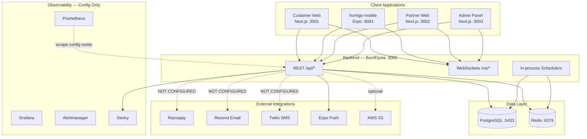

# HOMIGO System Architecture Map

**Audit date:** 2026-06-10  
**Method:** Code discovery + live execution (`/health`, `/ready`, smoke scripts)  
**Evidence rule:** No documentation trusted without runtime confirmation.

---

## Ecosystem Overview

---

## 1. Web Frontend (Customer)

| Attribute | Value |
|-----------|-------|
| Path | `apps/web` |
| Stack | Next.js 15, React 19, TanStack Query, Zustand |
| Port | **3001** |
| API base | `NEXT_PUBLIC_API_URL` → `http://localhost:3000` |
| Auth | JWT Bearer + `homigo_session` marker cookie + middleware |
| Routes | 26 pages (home, services, bookings, wallet, membership, referrals, notifications, settings, support, profile, auth, legal) |

**Execution evidence:**
- `GET http://localhost:3001` → **200** (2026-06-10)
- `npm run build` (web) → **PASS** — 30 routes including middleware, sitemap, robots
- Protected routes redirect **307** → `/login` when no session cookie

---

## 2. Mobile App

| Attribute | Value |
|-----------|-------|
| Path | `homigo-mobile/` (repo root; `apps/mobile` is stub) |
| Stack | Expo 54, Expo Router 6, React Native 0.81, NativeWind |
| API | `EXPO_PUBLIC_API_URL` → `http://localhost:3000` |
| Screens | Home, Services, Bookings, Wallet, AI, Profile, Auth, Legal, Rate |

**Execution evidence:**
- `npm run typecheck` → **PASS** (2026-06-10)
- **No device/emulator E2E executed** in this audit

---

## 3. Backend API

| Attribute | Value |
|-----------|-------|
| Path | `apps/backend` |
| Stack | Bun, Elysia.js, Prisma 6, PostgreSQL |
| Port | **3000** |
| Tests | **480 pass / 0 fail** (`bun test`, 2026-06-10) |

**REST prefixes (21):** `/api/auth`, `/api/users`, `/api/services`, `/api/stats`, `/api/providers`, `/api/bookings`, `/api/payments`, `/api/ratings`, `/api/wallet`, `/api/tracking`, `/api/notifications`, `/api/ai`, `/api/admin`, `/api/subscriptions`, `/api/support`, `/api/referrals`, `/api/hcoins`, `/api/giftcards`, `/api/legal`, `/api/compliance`, `/api/partner`

**WebSockets:** `/ws/tracking/:bookingId`, `/ws/notifications`, `/ws/booking/:bookingId`, `/ws/earnings/:providerId`

**Ops:** `GET /health`, `GET /ready`, `GET /metrics`, `GET /api/v1/status`

---

## 4. Database

| Attribute | Value |
|-----------|-------|
| Engine | PostgreSQL 16 (Docker `postgres:16-alpine`) |
| Host port | **5433** → container 5432 |
| ORM | Prisma (`apps/backend/prisma/schema.prisma`) |
| Migrations | 20+ applied (P0–P4 hardening, money paise dual-write, saved payment methods) |

**Execution evidence:**
- `/health` → `database: ok`
- `/ready` → `database: healthy` (78ms latency)
- Orphan checks → **0** orphans, **0** money drift (see `database-integrity-report.md`)

---

## 5. Admin Panel

| Attribute | Value |
|-----------|-------|
| Path | `apps/admin-panel` |
| Stack | Next.js 15, TanStack Query |
| Port | **3003** |
| API | `NEXT_PUBLIC_API_URL` → `http://localhost:3000/api/admin/*` |

**Execution evidence:**
- `smoke-admin-api.ts` → **12/12 PASS**
- `npm run build` → **PASS**
- UI server **NOT RUNNING** during audit (`verify-full-stack.ts` timeout on :3003)

---

## 6. Provider/Partner Panel

| Attribute | Value |
|-----------|-------|
| Path | `apps/partner-web` |
| Stack | Next.js 15, Recharts |
| Port | **3002** |
| Registration | `/api/partner/*` multi-step KYC flow |

**Execution evidence:**
- `smoke-partner-routes.ts` → **21/21 PASS**
- `npm run build` → **PASS**
- UI server **NOT RUNNING** during audit (timeout on :3002)

---

## 7. Razorpay

| Layer | Path |
|-------|------|
| Service | `apps/backend/src/services/razorpay.service.ts` |
| Webhook | `POST /api/payments/webhook` |
| Client (web/partner/mobile) | `use-razorpay-checkout` hooks |

**Execution evidence:**
- `/ready` → `razorpay.configured: false`, `razorpayWebhook.configured: false`
- Dev mode creates mock orders (`order_dev_*`) — adversarial tests confirm wallet top-up path
- **Live payment capture NOT verified** — keys absent in environment

---

## 8. Email Service

| Provider | Resend |
| Path | `apps/backend/src/services/email.service.ts` |
| Env | `RESEND_API_KEY`, `EMAIL_FROM` |

**Execution evidence:** `/ready` → `email.configured: false` (console fallback in dev)

---

## 9. Push Notifications

| Provider | Expo Push (`expo-server-sdk`) |
| Path | `apps/backend/src/services/push-delivery.service.ts` |
| Mobile | `expo-notifications` in `homigo-mobile` |

**Execution evidence:** Backend smoke tests confirm WebSocket notification channel closes cleanly; push delivery to physical device **NOT executed**.

---

## 10. Redis

| Attribute | Value |
|-----------|-------|
| Image | `redis:7-alpine` on **6379** |
| Client | `apps/backend/src/lib/redis.ts` |
| Uses | Rate limits, WS fan-out, scheduler leader locks, cache |

**Execution evidence:**
- `/health` → `redis: ok`
- `smoke-redis.ts` → **17/17 PASS** (pub/sub, rate limit, metrics)

---

## 11. Queue Workers

**No separate worker process.** Background work runs in-process:

| Mechanism | File |
|-----------|------|
| Interval schedulers | `apps/backend/src/lib/maintenance.ts` |
| Leader election | `apps/backend/src/lib/distributed-scheduler.ts` |
| Assignment queue poll (30s) | `assignment-engine.service.ts` |

Jobs: OTP cleanup, payment reconcile, finance reconcile, settlement sync, retention, backups, alert eval, assignment dispatch.

---

## 12. File Storage

| Use | Implementation |
|-----|----------------|
| Rating photos | Local `uploads/ratings/` |
| Partner KYC docs | Local `FILE_UPLOAD_DIR` |
| Compliance exports | S3 if `AWS_S3_BUCKET` set, else local |
| DB backups | S3 optional via `backup-db.ts` |

**Execution evidence:** S3 backup validation script exists; **not executed** in this audit.

---

## 13. Analytics

| Surface | Implementation |
|---------|----------------|
| Admin analytics | `/api/admin/analytics` — smoke **200** |
| Partner analytics | `/api/providers/me/dashboard` — smoke **200** |
| Customer stats | `/api/stats` |
| Membership insights | `membership-insights.service.ts` |

---

## 14. Monitoring

| Component | Path | Live? |
|-----------|------|-------|
| Prometheus scrape config | `apps/backend/monitoring/prometheus.yml` | Config only |
| Alert rules | `monitoring/rules/homigo-alerts.yml` | Config only |
| Alertmanager | `monitoring/alertmanager.yml` | Config only |
| Grafana dashboard | `monitoring/grafana/dashboards/homigo-observability.json` | Config only |
| App metrics | `GET /metrics` on backend | **Emits** (not scraped live) |
| Sentry | `observability.ts` | DSN-dependent |

**Execution evidence:**
- `p2:grafana` → **100% coverage** (9/9 metrics dashboarded + alerted)
- `p2:alerts` → **9/9 required alerts** routed (slack/email/pager/escalation flags true in config)

---

## 15. Scheduler/Cron Jobs

All in-process via `maintenance.ts` with Redis leader locks:

| Job | Interval |
|-----|----------|
| Assignment dispatch | 30s |
| Alert evaluation | 5m |
| Payment reconcile | 1h |
| Financial integrity | 1h |
| Token/security cleanup | 1h |
| Retention tick | 1h |
| OTP cleanup | 6h |
| Finance reconciliation | 24h |
| Settlement sync | 24h |
| Account deletion finalize | 24h |
| Data archival | 24h |
| DB backup | 1h (if `ENABLE_SCHEDULED_BACKUPS=true`) |

---

## Port Matrix

| Service | Port | Status (audit) |
|---------|------|----------------|
| Backend API | 3000 | ✅ Running |
| Customer Web | 3001 | ✅ Running |
| Partner Web | 3002 | ❌ Not running |
| Admin Panel | 3003 | ❌ Not running |
| PostgreSQL | 5433 | ✅ Healthy |
| Redis | 6379 | ✅ Healthy |
| Expo Metro | ~8081 | ❌ Not started |
