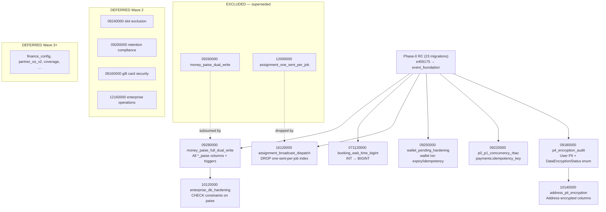

# Stage D — Step D-REMEDIATION

**Date:** 2026-08-04  
**Status:** **WAVE-1 CERTIFIED** — clean replay 31/31 @ `c31f154`  
**Scope:** STAGING ONLY — project `homigo-497619`  
**Production impact:** NONE

---

## Context

| Prior gate | Result |
|------------|--------|
| Event engine proof | **PASS** (outbox, consumers, idempotency, DLQ, replay) |
| API schema incompatibility | **DISCOVERED** — Prisma P2022 on deferred columns |
| Phase-0 DB | **23/23** through `20260731120000_event_foundation` |
| Deferred on disk | **25** untracked migrations (provenance: Step 6C audit) |

**Root cause:** Application `schema.prisma` @ `95fbb69` references columns/tables from deferred migrations. Staging DB matches Phase-0 RC (`e459175`) only. Any Prisma full-row select on `User`, `Address`, `Booking`, `Payment`, or `WalletTransaction` fails with P2022.

**Workaround in partial cert:** `stage-d-outbox-gate.ts` uses raw SQL INSERT (Phase-0 columns only) — bypasses Prisma, does not prove API lifecycle.

---

## 1. Stage-D API Path → Schema Dependency Matrix

Paths exercised by `apps/backend/scripts/stage-d-staging-certification.ts` and Stage-D runbook.

| Path | Endpoints / gates | Models touched (full-row Prisma) | Deferred columns blocking |
|------|-------------------|----------------------------------|---------------------------|
| **Booking** | D2 create, D3 accept, D5 start/complete | `User`, `Address`, `Booking`, `Provider`, `Payment`, `Earning`, `WalletTransaction` | `email_encrypted`, `*_paise`, `idempotency_key`, address encrypted fields |
| **Partner tracking** | D4 en_route → arrived | `Booking`, `Tracking`, `Provider`, `User` | Same User/Provider paise + encryption |
| **Payment** | Razorpay create-order, verify, webhook | `Payment`, `User`, `Booking`, `WalletTransaction` | `payments.idempotency_key`, `*_paise`, wallet hardening columns |

### Prisma select rule

Stage-D fixtures use `include` without `select`:

```typescript
// stage-d-staging-certification.ts — D1
prisma.user.findFirst({ include: { addresses: { take: 1 } } })
prisma.provider.findFirst({ include: { currentLocation: true, user: true } })
```

Prisma emits SELECT for **every scalar field** on included models. Missing DB columns → **P2022** regardless of whether application logic reads them.

---

## 2. Dependency Graph



### Hard dependencies (must not cherry-pick out of order)

| Migration | Requires |
|-----------|----------|
| `10140000_address_pii_encryption` | `DataEncryptionStatus` enum from `09180000` |
| `10120000_enterprise_db_hardening` | `*_paise` columns from `09280000` |
| `071120000_booking_wait_time_bigint` | `wait_time_ms` column from Phase-0 `08120000_membership_premium_engine` |

### Soft dependencies (runtime, not P2022)

| Migration | Notes |
|-----------|-------|
| `09240000_booking_slot_exclusion` | DB GiST exclusion only; columns **not** in Prisma schema — defer to Wave 2 |
| `16120000_assignment_broadcast` | No-op on staging (index never created); codifies broadcast dispatch intent |

---

## 3. Wave-1 Stage-D Minimum Release

**8 migrations** — smallest set that unblocks Prisma for all Stage-D API paths.

Machine-readable manifest: [`wave-1-migration-manifest.json`](./wave-1-migration-manifest.json)

| # | Migration | Stage-D paths | Why required |
|---|-----------|---------------|--------------|
| 1 | `20260609180000_p4_encryption_audit` | All | **Primary P2022 blocker** — `users.email_encrypted` |
| 2 | `20260609220000_p0_p1_concurrency_rbac` | Payment | `payments.idempotency_key` NOT NULL |
| 3 | `20260609250000_wallet_pending_hardening` | Payment, complete | `wallet_transactions` deferred columns |
| 4 | `20260609280000_money_paise_full_dual_write` | All money paths | `*_paise` on 12+ tables |
| 5 | `20260610120000_enterprise_db_hardening` | Booking, payment | CHECK constraints (depends on #4) |
| 6 | `20260610140000_address_pii_encryption` | Booking, tracking | D1 `addresses` include |
| 7 | `20260616120000_assignment_broadcast_dispatch` | Booking D3 | Broadcast dispatch |
| 8 | `20260711120000_booking_wait_time_bigint` | Booking D3 accept | BigInt type parity |

### Explicitly excluded from Wave-1

| Migration | Reason |
|-----------|--------|
| `09260000_money_paise_dual_write` | Superseded by `09280000` |
| `12000000_assignment_one_sent_per_job` | Superseded by `16120000` |
| `09120000`, `09140000`, `09230000` | Admin RBAC / token security — not in Stage-D cert path |
| `12140000_support_ticket_messages` | No Stage-D API dependency |
| Wave 2/3 batch (15 migrations) | Feature surfaces not required for D2–D8 gates |

### Step 6C Wave-1 vs Stage-D Wave-1 delta

Original Step 6C Wave-1 included RBAC, token security, support messages — **without encryption**. That set **does not** unblock Stage-D because `email_encrypted` is Wave-2 in Step 6C taxonomy.

**Decision:** Stage-D Wave-1 **pulls forward** two Wave-2 encryption migrations (`09180000`, `10140000`) as runtime prerequisites. Remaining Wave-2 items stay deferred.

---

## 4. Controlled Release Procedure

### 4a. Commit Wave-1 migrations (git gate)

```powershell
# From clean branch off main
git add apps/backend/prisma/migrations/20260609180000_p4_encryption_audit
git add apps/backend/prisma/migrations/20260609220000_p0_p1_concurrency_rbac
git add apps/backend/prisma/migrations/20260609250000_wallet_pending_hardening
git add apps/backend/prisma/migrations/20260609280000_money_paise_full_dual_write
git add apps/backend/prisma/migrations/20260610120000_enterprise_db_hardening
git add apps/backend/prisma/migrations/20260610140000_address_pii_encryption
git add apps/backend/prisma/migrations/20260616120000_assignment_broadcast_dispatch
git add apps/backend/prisma/migrations/20260711120000_booking_wait_time_bigint
# DO NOT add 09260000 or 12000000
```

### 4b. Clean DB replay proof

1. Clone replay instance from authoritative PITR marker (`homigo-staging-step6a-pitr-20260803`).
2. Run `prisma migrate deploy` from **clean worktree** at Wave-1 commit SHA.
3. Expect **31/31** (23 Phase-0 + 8 Wave-1).
4. Run `migration-integrity-audit.ts --validate` — disk = `_prisma_migrations` = applied.
5. Fingerprint post-Wave-1 schema; store alongside `phase0-schema-inventory.json`.

### 4c. Backup / PITR marker

Before staging apply:

- Confirm deletion protection ON on target instance.
- Record pre-Wave-1 PITR timestamp.
- Create named clone: `homigo-staging-wave1-pitr-YYYYMMDD`.

### 4d. Apply to staging

```powershell
# Deploy migrate job @ Wave-1 SHA against authoritative instance
# Verify: prisma migrate status → 31 migrations, 0 pending
```

---

## 5. Post-Apply Certification Sequence

| Step | Gate | Command / artifact |
|------|------|-------------------|
| 1 | Schema parity | `step7-schema-audit.mjs` (extend for Wave-1 columns) |
| 2 | Real booking API E2E | `stage-d-staging-certification.ts` D2–D5 |
| 3 | Partner tracking E2E | D4 gates (full HTTP path) |
| 4 | Razorpay TEST secrets | Replace `STAGING_RAZORPAY_KEY_ID` PLACEHOLDER |
| 5 | Payment E2E | create-order → verify → webhook |
| 6 | 2-instance concurrency | min-instances=2 load spot-check |
| 7 | Failure/retry/DLQ/replay | D6–D7 revalidation |
| 8 | 30–60 min soak | `homigo_outbox_pending`, `homigo_dlq_unresolved` |
| 9 | Grafana + alerts | Live alert verification |
| 10 | **STAGE D CERTIFIED** | Zero critical regression |

---

## 6. Known Remaining Gaps (post Wave-1)

| Gap | Resolution |
|-----|------------|
| Schema orphans: `Geofence`, `GeofenceEvent`, `CityCoverageOverride` | New migrations required — no deferred folder exists |
| Slot exclusion (`09240000`) | Wave 2 — DB hardening, not Prisma P2022 |
| Admin RBAC payment refund | Wave 1 optional extension if refund E2E added |
| Gift cards, partner OS v2, coverage | Wave 3 — feature surfaces |

---

## 7. Verdict

| Gate | Status |
|------|--------|
| Minimum migrations determined | **DONE** — 8 migrations |
| Dependency graph built | **DONE** — see §2 |
| Wave-1 manifest created | **DONE** — `wave-1-migration-manifest.json` |
| Clean DB replay proof | **PASS** — 31/31 @ `c31f154` |
| Staging apply | **PENDING** (separate gate) |
| Stage-D full certification | **PENDING** (after staging apply + Razorpay TEST) |

**STEP D-REMEDIATION (analysis): PASS**  
**STEP D-REMEDIATION (execution): PASS** — see `step-d-wave1-clean-replay-certification.md`.
