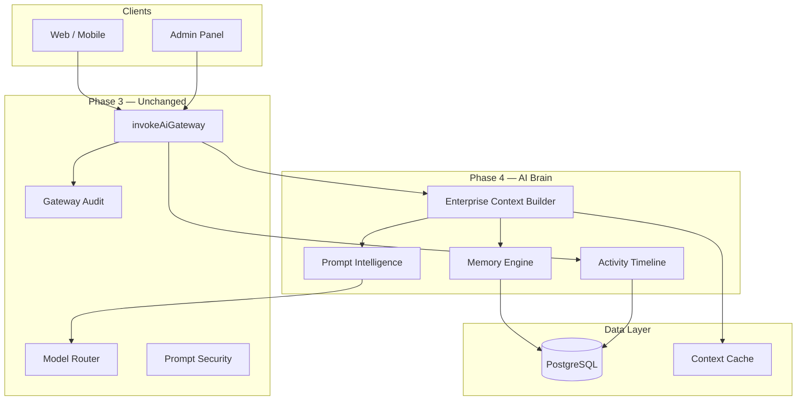

# Phase 4 Enterprise AI Brain — Implementation Report

## Overview

Phase 4 delivers the Enterprise AI Brain — context engineering, memory platform, and prompt intelligence — as an extension layer atop the Phase 3 AI Gateway.

## Architecture

## Deliverables

### Backend (`apps/backend/src/ai-brain/`)

| Component | Path | Purpose |
|-----------|------|---------|
| Context Builder | `context/enterprise-context-builder.ts` | Dynamic context assembly |
| Customer Collector | `context/collectors/customer-context.ts` | Profile, wallet, bookings, HCoin |
| Partner Collector | `context/collectors/partner-context.ts` | Performance, earnings, jobs |
| Admin Collector | `context/collectors/admin-context.ts` | Ops, finance, platform health |
| Memory Engine | `memory/memory-engine.ts` | 10 memory types with TTL |
| Conversation Memory | `memory/conversation-memory.ts` | Summaries, pins, recall |
| Prompt Registry | `prompts/prompt-registry.ts` | Centralized prompt library |
| Prompt Versioning | `prompts/prompt-versioning.ts` | Version, approve, rollback |
| Prompt Intelligence | `prompts/prompt-intelligence.ts` | Composition, compression |
| Activity Timeline | `timeline/activity-timeline.ts` | Full AI audit trail |
| Brain Security | `security/brain-security.ts` | PII, secrets, isolation |

### API Routes (`/api/ai/`)

20+ new admin endpoints for context, memory, prompts, timeline, conversation memory.

### Admin Panel

- `/ai-brain` — Main console
- `/ai-brain/context` — Context Explorer
- `/ai-brain/memory` — Memory Explorer
- `/ai-brain/prompts` — Prompt Registry
- `/ai-brain/timeline` — Activity Timeline

### Observability

- 12 new Prometheus metrics
- Grafana dashboard `homigo-ai-brain`
- 5 alert rules in `homigo_ai_brain` group

### Documentation

- ADR-016, API docs, runbooks, security review, certification report

## What Was NOT Built (Per Spec)

- AI Agents, workflow automation, autonomous decisions
- Vision AI, Voice AI, fine-tuning, multi-agent systems

These belong to Phase 5+.

## Quality Gates

- No placeholders or TODOs in production code
- Backward compatible with Phase 0–3
- Enterprise-grade error handling with graceful degradation
- Hash-only audit (no raw prompts in timeline)

## Next Steps (Phase 5)

- RAG / vector DB integration
- Client wiring to gateway endpoints
- Production prompt approval workflow
- Semantic memory with embeddings
