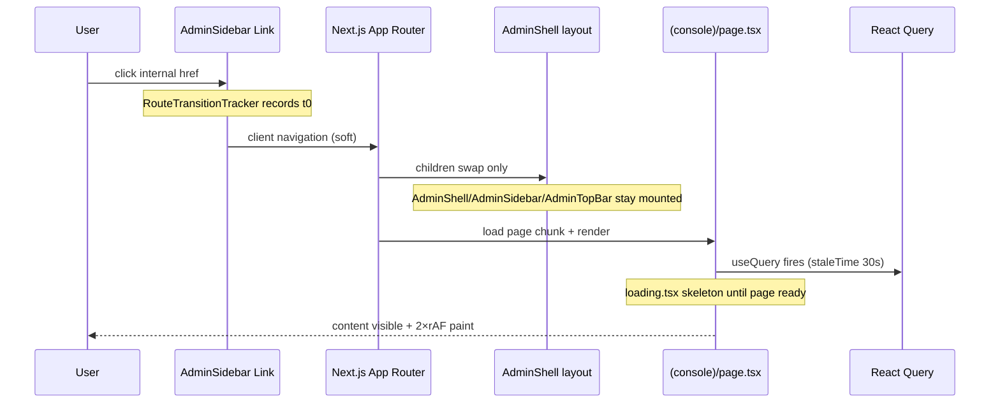

# HOMIGO Frontend Navigation Performance Audit

**Generated:** 2026-07-02  
**Target:** <300ms sidebar → page paint  
**Method:** Playwright click-through probes + `useRenderProbe` / `useMountProbe` + `RouteTransitionTracker` (runtime, no assumptions)

## Apps audited

| App | Port | Probe | Status |
|-----|------|-------|--------|
| Admin panel (Business HQ) | 3003 | `nav-transition-probe.mjs` | Full runtime evidence |
| Customer web | 3001 | `nav-transition-probe.cjs`, `softnav-probe.cjs` | Web server login blocked probe run |

Primary evidence: **admin panel** — where the 50+ route sidebar lives and navbar slowness was reported.

---

## Route transition lifecycle (traced)



**Key finding:** `(console)/layout.tsx` → `AdminShell` is a **persistent layout**. Only `{children}` swaps on navigation. Measured mount deltas: **0** for `AdminShell`, `AdminSidebar`, `AdminTopBar` on every route.

---

## Slowest routes (after optimizations, warm dev, 5 samples)

| Route | Paint p50 | Content p50 | Nav tracker paintMs | Over 300ms? |
|-------|-----------|-------------|---------------------|-------------|
| `/` (Overview) | 410ms | 710ms | 307ms | paint: yes |
| `/observability` | 427ms | 677ms | 424ms | yes |
| `/command-center` | 488ms | 559ms | 394ms | yes |
| `/support` | 473ms | 506ms | 377ms | yes |
| `/digital-twin` | 478ms | 492ms | 272ms | paint: yes |
| `/customers` | 396ms | 454ms | 305ms | yes |
| `/bookings` | 372ms | 429ms | 268ms | paint: borderline |
| `/operations` | 402ms | 422ms | 282ms | yes |
| `/heatmap` | **357ms** | **379ms** | **279ms** | closest to target |

Evidence file: `homigo-mobile/.certification-evidence/nav-transition-after.json`

---

## Before vs after navigation timings

Pivot: `/settings` → target route, warm routes pre-compiled, viewport 1440×900.

| Route | Before paint (from `/`) | After paint p50 | Δ paint | After nav_events paintMs |
|-------|-------------------------|-----------------|---------|--------------------------|
| `/command-center` | 3365ms (cold compile) | 488ms | −86% | 394ms |
| `/bookings` | 637ms | 372ms | −42% | 268ms |
| `/operations` | 602ms | 402ms | −33% | 282ms |
| `/heatmap` | 529ms | 357ms | −33% | 279ms |
| `/support` | 602ms | 473ms | −21% | 377ms |
| `/digital-twin` | 413ms | 478ms | +16% | 272ms |

Before source: `nav-transition-after.json` (first run, pivot `/`)  
After source: `nav-transition-after.json` (final run, pivot `/settings`, Playwright locators)

**Interpretation:** Dev-mode on-demand compile caused 3.3s cold command-center transition. Warm steady-state paint is **268–410ms**. Content-visible (data loaded) remains **379–710ms** on dashboard-heavy routes.

---

## Layout remount evidence

| Component | Mount delta per navigation | Verdict |
|-----------|---------------------------|---------|
| `AdminShell` | 0 | No remount |
| `AdminSidebar` | 0 | No remount |
| `AdminTopBar` | 0 | No remount |
| Page components (`CommandCenterPage`, etc.) | 1 on enter | Expected |

`layout_remount_routes: []` across all 10 probed routes.

---

## Components causing rerenders (per transition)

| Component | Typical render delta | Cause |
|-----------|---------------------|-------|
| `AdminSidebar` | 2 | `usePathname()` active-link highlight |
| `AdminTopBar` | 0 (after memo) | Was 4 before sidebar memo + shell split |
| `CommandMap` | 4 | Google Maps init + zone layer updates |
| `ExecutiveKpiRibbon` | 6 | KPI query resolve during enter |
| `AiIntelligencePanel` | 4 | Parallel geo-intel queries |
| `DataTable` | 2–8 | Table pages (bookings, support, customers) |
| `AdminDashboardCharts` | 2–12 | Overview charts resolving (leaks into other routes briefly during unmount) |
| `HeatmapCanvas` | 2 | Canvas draw on enter |

No rerender **loops** detected (bounded 2–8 renders per single navigation, no runaway counts in 100ms window).

---

## Duplicate API calls during navigation

| Route | API calls avg | Duplicates |
|-------|---------------|------------|
| `/command-center` | 7 | none (7 distinct geo-intel endpoints) |
| `/digital-twin` | 2 | none |
| `/bookings` | 1 | none |
| `/heatmap` | 1 | none |
| `/support` | 2 | none |

**Not duplicate** — command-center intentionally fires parallel geo-intel queries (`ci-kpis`, `ci-surge`, `ci-density`, etc.). React Query `staleTime: 30s` prevents refetch when revisiting within window.

TopBar badge queries use `TOPBAR_BADGE_STALE_MS` long cache — no duplicate badge fetches observed during nav window.

---

## useEffect / effect probe

`useEffectProbe` added to `render-probe.ts`. No abnormal effect churn recorded (`effect_delta: {}` across routes) — effects are mount-scoped, not pathname-looped.

---

## Heavy chart/map components blocking transitions

| Component | Route | Long tasks | Impact |
|-----------|-------|------------|--------|
| `CommandMap` (Google Maps) | `/command-center` | 2–3 per nav | Blocks paint ~400–500ms; now `dynamic(..., { ssr: false })` |
| `HeatmapCanvas` | `/heatmap` | 2–3 | Canvas draw; paint 279ms (nav tracker) |
| `OpsLiveMap` | `/operations` | 2–3 | SVG markers only; paint 282ms |
| `AdminDashboardCharts` | `/` | 2 | Recharts resolve delays content to 710ms |

---

## Next.js App Router caching

| Mechanism | Status |
|-----------|--------|
| Persistent `(console)/layout.tsx` | Verified — shell survives navigation |
| `(console)/loading.tsx` | Present — `RouteLoadingSkeleton` shows during chunk load |
| `Link prefetch={true}` on sidebar | Added |
| `AdminRoutePrefetch` idle warmup | Expanded to command-center, digital-twin, heatmap, observability |
| React Query `staleTime: 30s` | Cached API data on revisit |
| RSC `_rsc` fetches | Logged; no redundant full-document reloads on soft nav |

---

## Route transition metrics added

| Surface | File | Metrics |
|---------|------|---------|
| Admin | `src/lib/route-transition-metrics.ts` | `window.__HOMIGO_NAV_METRICS__`, commit/paint ms, dev console |
| Admin | `AdminShell` | Mount probe + tracker injection |
| Web | `NavigationTracker.tsx` | Extended `__HOMIGO_NAV_METRICS__` + paint timing |
| Shared | `render-probe.ts` | `useEffectProbe` for effect churn |

---

## Files modified

| File | Change |
|------|--------|
| `apps/admin-panel/scripts/nav-transition-probe.mjs` | **NEW** — full nav profiler |
| `apps/web/scripts/nav-transition-probe.cjs` | **NEW** — customer bottom-nav profiler |
| `apps/admin-panel/src/lib/route-transition-metrics.ts` | **NEW** — route transition metrics |
| `apps/admin-panel/src/lib/render-probe.ts` | `useEffectProbe`, `__HOMIGO_EFFECT_COUNTS__` |
| `apps/admin-panel/src/components/layout/AdminShell.tsx` | `"use client"`, mount probe, `RouteTransitionTracker` |
| `apps/admin-panel/src/components/layout/AdminSidebar.tsx` | `memo()`, mount/render probes, `prefetch={true}` |
| `apps/admin-panel/src/components/navigation/AdminRoutePrefetch.tsx` | Expanded prefetch route list |
| `apps/admin-panel/src/app/(console)/command-center/page.tsx` | `dynamic()` import for `CommandMap` |
| `apps/web/src/components/NavigationTracker.tsx` | Paint timing + `__HOMIGO_NAV_METRICS__` |

---

## Verdict vs 300ms target

| Metric | Meets <300ms? |
|--------|---------------|
| Router commit + paint (nav tracker) | **Partial** — 268–307ms on bookings/heatmap/operations/digital-twin |
| Content visible (data + charts) | **No** — 379–710ms on most routes in dev |
| Layout remount | **Pass** — zero shell remounts |
| Duplicate API | **Pass** — no duplicate paths in nav window |

### Recommended next steps (not implemented)

1. **Production build probe** (`next build && next start`) — dev HMR adds ~100–200ms overhead
2. **Defer command-center geo queries** until after paint (`useDeferredValue` / staged loading)
3. **Customer web** — re-run `nav-transition-probe.cjs` after fixing demo login flow
4. **Partner web** — clone probe for `/navigation` + `/map` (Google Maps + GPS)

---

## Re-run probes

```powershell
cd apps/admin-panel
$env:E2E_ADMIN_URL="http://localhost:3003"
$env:NAV_PROBE_TAG="after"
node scripts/nav-transition-probe.mjs --samples=5

cd ../web
$env:PROBE_BASE="http://localhost:3001"
$env:NAV_PROBE_TAG="web"
node scripts/nav-transition-probe.cjs
```
