# Ecosystem Cleanup Certification

**Run ID:** eco-mr4sqcm9
**Certified at:** 2026-07-03T10:34:22.950Z
**Verdict:** **PASS**
**Transactional:** yes

## Exact failing relation (historical)

`hcoin_wallets_user_id_fkey` — `hcoin_wallets.user_id` → `users.id` (NO onDelete CASCADE).

Booking completion calls `hcoinService.earn()` which upserts `hcoin_wallets` for the customer.
Deleting `users` before `hcoin_wallets` triggered the FK violation.

## Cleanup order — before (broken)

```
...booking_children
wallet_transactions
locations
providers
hcoin_transactions
membership_benefit_usage
...other_user_children
addresses
users  ← FAIL: hcoin_wallets still present
services
```

## Cleanup order — after (fixed)

```
location_history
membership_coupon_redemptions
membership_cashbacks
coupon_usages
ratings
fraud_alerts
referral_commissions
assignment_audits
assignment_attempts
assignment_jobs
activity_logs
support_tickets
payment_settlements
payments
earnings
notifications
provider_match_scores
tracking
bookings
wallet_transactions
locations
provider_wallet_reservations
providers
subscription_invoices
hcoin_transactions
hcoin_wallets
membership_benefit_usage
membership_cashbacks
membership_coupon_redemptions
provider_match_scores
referral_commissions
fraud_alerts
referral_transactions
referral_withdrawals
user_subscriptions
wallet_transfers
gift_card_transactions
gift_cards
coupon_usages
activity_logs
fraud_signals
notifications
payments
addresses
users
services
```

## User FK dependency graph (Restrict relations)

```mermaid
graph TD
  users[(users)]
  membership_benefit_usage[membership_benefit_usage] -->|Restrict| users
  user_subscriptions[user_subscriptions] -->|Restrict| users
  referral_withdrawals[referral_withdrawals] -->|Restrict| users
  hcoin_wallets[hcoin_wallets] -->|Restrict| users
  hcoin_transactions[hcoin_transactions] -->|Restrict| users
  gift_card_transactions[gift_card_transactions] -->|Restrict| users
  membership_cashbacks[membership_cashbacks] -->|Restrict| users
  provider_match_scores[provider_match_scores] -->|Restrict| users
  membership_coupon_redemptions[membership_coupon_redemptions] -->|Restrict| users
  referral_transactions[referral_transactions] -->|Restrict| users
  referral_commissions[referral_commissions] -->|Restrict| users
  wallet_transfers[wallet_transfers] -->|Restrict| users
  gift_cards[gift_cards] -->|Restrict| users
  coupon_usages[coupon_usages] -->|Restrict| users
  activity_logs[activity_logs] -->|Restrict| users
  fraud_signals[fraud_signals] -->|Restrict| users
  fraud_alerts[fraud_alerts] -->|Restrict| users
  bookings[(bookings)] -->|Cascade| users
  hcoin_transactions -->|Restrict| users
  hcoin_wallets -->|Restrict| users
```



| Child table | Parent | onDelete |
|-------------|--------|----------|
| membership_benefit_usage | users | Restrict |
| user_subscriptions | users | Restrict |
| referral_withdrawals | users | Restrict |
| hcoin_wallets | users | Restrict |
| hcoin_transactions | users | Restrict |
| gift_card_transactions | users | Restrict |
| membership_cashbacks | users | Restrict |
| provider_match_scores | users | Restrict |
| membership_coupon_redemptions | users | Restrict |
| referral_transactions | users | Restrict |
| referral_commissions | users | Restrict |
| wallet_transfers | users | Restrict |
| gift_cards | users | Restrict |
| coupon_usages | users | Restrict |
| activity_logs | users | Restrict |
| fraud_signals | users | Restrict |
| fraud_alerts | users | Restrict |

## Fixture IDs

| Entity | ID |
|--------|-----|
| customer | `cmr4sqct40003tzfgdjmqlz1w` |
| vendor | `cmr4sqcvg0007tzfgy34sfo43` |
| provider | `cmr4sqcw0000atzfgv0x9s7xb` |
| address | `cmr4sqctt0005tzfgptsvtfaw` |
| service | `cmr4sqcpu0000tzfgytnk00hi` |
| booking | `cmr4sqd9r008atzs031vcpyhr` |

## Cleanup steps

| Table | Deleted |
|-------|---------|
| location_history | 1 |
| membership_coupon_redemptions | 0 |
| membership_cashbacks | 0 |
| coupon_usages | 0 |
| ratings | 0 |
| fraud_alerts | 0 |
| referral_commissions | 0 |
| assignment_audits | 3 |
| assignment_attempts | 10 |
| assignment_jobs | 1 |
| activity_logs | 0 |
| support_tickets | 0 |
| payment_settlements | 0 |
| payments | 0 |
| earnings | 1 |
| notifications | 0 |
| provider_match_scores | 0 |
| tracking | 1 |
| bookings | 1 |
| wallet_transactions | 0 |
| locations | 1 |
| provider_match_scores | 1 |
| notifications | 0 |
| provider_wallet_reservations | 0 |
| providers | 1 |
| hcoin_transactions | 1 |
| hcoin_wallets | 1 |
| membership_benefit_usage | 0 |
| membership_cashbacks | 0 |
| membership_coupon_redemptions | 0 |
| provider_match_scores | 9 |
| referral_commissions | 0 |
| fraud_alerts | 0 |
| referral_transactions | 0 |
| referral_withdrawals | 0 |
| user_subscriptions | 0 |
| wallet_transfers | 0 |
| gift_card_transactions | 0 |
| gift_cards | 0 |
| coupon_usages | 0 |
| activity_logs | 1 |
| fraud_signals | 0 |
| notifications | 4 |
| payments | 0 |
| addresses | 1 |
| users | 2 |
| services | 1 |

## Post-cleanup verification

| Table | Remaining |
|-------|-----------|
| users | 0 |
| providers | 0 |
| addresses | 0 |
| services | 0 |
| bookings | 0 |
| hcoin_wallets | 0 |
| hcoin_transactions | 0 |
| wallet_transactions | 0 |
| notifications | 0 |

## Re-run

```powershell
cd apps/backend
bun --env-file=.env run scripts/ecosystem-enterprise-certification.ts
bun --env-file=.env run scripts/ecosystem-cleanup-probe.ts
```
